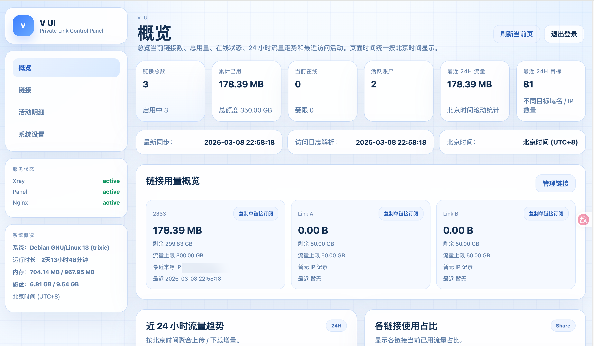
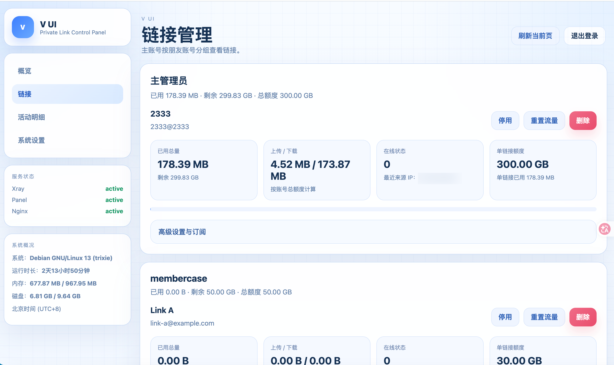

# V UI

[](https://github.com/Aaowu/V-UI/actions/workflows/ci.yml)
[](./LICENSE)
[](https://github.com/Aaowu/V-UI)
[](https://www.python.org/)

一个面向 `Xray + VLESS + REALITY (xtls-rprx-vision)` 的轻量控制面板。

适合：
- 自用
- 偶尔分享给朋友
- 需要直接管理链接、流量上限、已用流量、订阅导入、访问活动明细

## 特点

- 轻量：`FastAPI + Jinja2 + SQLite`
- 友好：一键安装脚本支持交互式输入
- 清晰：主账号 / 朋友账号权限分层
- 实用：支持总流量池、多链接共享额度、客户端流量头
- 可观测：活动明细、访问目标、近 24 小时趋势图

## 界面概览

当前内置页面：
- 概览
- 链接管理
- 活动明细
- 系统设置

### 页面截图

**1. 概览页**



**2. 链接管理页**



## 功能

- 登录后台
- 主账号 / 朋友账号权限分层
  - 主账号：可看全部、可配置系统、可新增朋友账号
  - 朋友账号：只看自己的概览 / 链接 / 活动 / 账户设置
- 链接管理
  - 新建 / 编辑 / 启停 / 删除
  - 独立 UUID
  - 独立订阅 Token
  - `Loon` 一键导入 / 订阅地址 / 通用 `vless://` / 二维码
- 流量管理
  - 朋友账号拥有一份“总额度”
  - 朋友账号可创建多个链接
  - 每个链接可设置“单链接额度”
  - 所有单链接额度总和不能超过该朋友账号的总额度
  - 链接用量与账号总额度联动显示
  - 每月重置日
  - 用尽后等待下一个周期恢复
- 概览页
  - 近 24 小时流量趋势
  - 各链接使用占比
  - 链接用量概览
  - 最近访问目标
- 活动明细页
  - 主账号：可看全部并按账户筛选
  - 朋友账号：只看自己的活动明细
- 系统设置页
  - 主账号：域名 / SNI / 端口 / Short ID / Reality Target / 服务控制 / 存储上限 / 新增朋友账号
  - 朋友账号：仅修改自己的用户名 / 密码
- 客户端流量信息
  - 订阅响应返回 `Subscription-Userinfo`
  - 客户端更新订阅后，可显示当前已用与总流量

## 安全边界说明

对于 `HTTPS / REALITY` 流量：
- 可以被动观察到目标域名 / IP、访问时间、来源 IP、路由方向
- 不能安全地读取完整网页 URL Path

如果强行实现完整 URL 级别明细，需要中间人解密，会破坏协议安全和隐私。本项目不这么做。

## 页面时间

页面默认显示：
- `Asia/Shanghai`
- `北京时间 (UTC+8)`

## 一键安装

**注意：当前这份一键安装脚本是“完整面板模式”，至少需要你准备一个已经解析到服务器的域名。**

脚本已经收口成“小白模式”：
- 直接运行时，默认只问你域名
- 证书路径会自动按 Let's Encrypt 默认路径推导
- 如果证书不存在，会自动尝试申请证书
- Reality 的 `Server Domain / SNI / Target` 都会自动推导
- 安装前会尽量检查域名解析是否指向当前服务器，并提醒你确认 80/443 已放行

默认情况下，最少只需要提供：

```bash
DOMAIN=panel.example.com
```

其余参数默认会这样处理：

```bash
TLS_CERT=/etc/letsencrypt/live/<DOMAIN>/fullchain.pem
TLS_KEY=/etc/letsencrypt/live/<DOMAIN>/privkey.pem
REALITY_SERVER_DOMAIN=<DOMAIN>
REALITY_SNI=<DOMAIN>
REALITY_TARGET=127.0.0.1:443
```

这个仓库自带的一键安装脚本会自动完成：
- 安装官方 `Xray`（如果系统里还没有）
- 生成 `VLESS + REALITY + xtls-rprx-vision`
- 写入 `Xray API` / `access log` / `error log`
- 安装本面板
- 写入 `systemd`
- 写入 `nginx` 反代配置
- 打开 Reality 端口并尝试持久化防火墙规则

### 1. 准备证书和域名

你需要先有：
- 一个可解析到 VPS 的域名
- 80/443 端口可正常访问

如果系统里还没有证书，安装脚本会自动尝试申请 Let's Encrypt 证书。

### 2. 准备配置

```bash
cp .env.example .env
```

最少只需要填写：

```bash
DOMAIN=panel.example.com
```

如果你希望自定义端口或证书邮箱，可以再额外填写：

```bash
PANEL_PORT=9200
REALITY_PORT=30828
CERTBOT_EMAIL=you@example.com
```

### 3. 执行安装

直接运行会进入交互式提问：

```bash
bash scripts/install.sh
```

示例交互：

```text
[INFO] 进入交互式安装模式
请输入面板域名 (例如 panel.example.com): panel.example.com
请输入面板监听端口 [9200]:
请输入 Reality 端口 [30828]:
```

也可以直接临时传参：

```bash
DOMAIN=panel.example.com \
TLS_CERT=/etc/letsencrypt/live/panel.example.com/fullchain.pem \
TLS_KEY=/etc/letsencrypt/live/panel.example.com/privkey.pem \
REALITY_SERVER_DOMAIN=panel.example.com \
REALITY_SNI=panel.example.com \
bash scripts/install.sh
```

安装完成后会输出：
- 面板登录地址
- 初始主账号文件位置
- 默认 `VLESS Reality Vision` 链接
- 常用管理命令

## 本地开发

```bash
python3 -m venv .venv
source .venv/bin/activate
pip install -r requirements.txt
uvicorn app:app --host 127.0.0.1 --port 9200 --reload
```

## 发布到 GitHub 前

执行：

```bash
bash scripts/release-sanitize.sh
```

这个脚本会：
- 清理本地 `.venv`
- 清理 `data/panel.db`
- 清理 `data/admin_credentials.txt`
- 清理 `__pycache__`
- 粗扫常见敏感信息模式

## 常用文件

- 主程序：`app.py`
- 模板：`templates/`
- 静态资源：`static/`
- 一键安装：`scripts/install.sh`
- 发布前脱敏：`scripts/release-sanitize.sh`
- 示例配置：`.env.example`

## 常用命令

```bash
systemctl status icu-panel
systemctl restart icu-panel
journalctl -u icu-panel -f

systemctl status xray
journalctl -u xray -f
```
